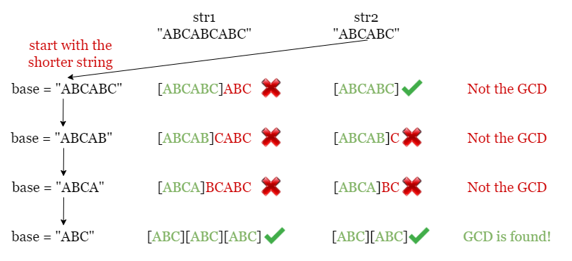
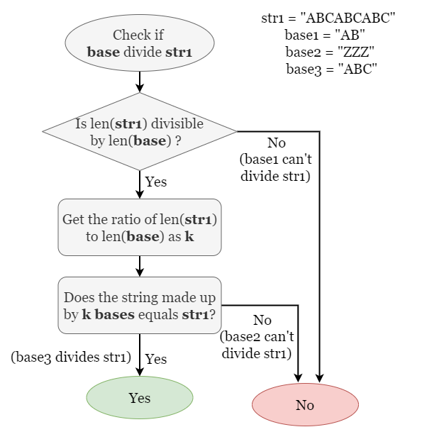
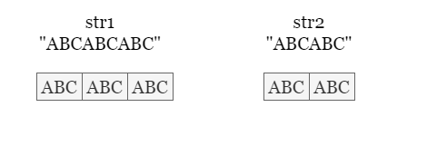
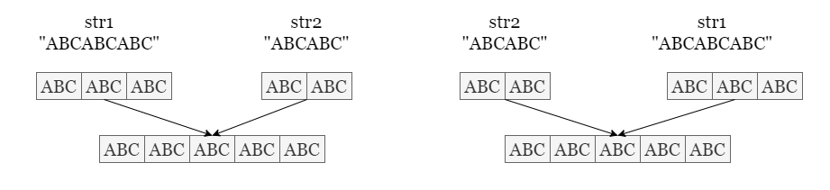
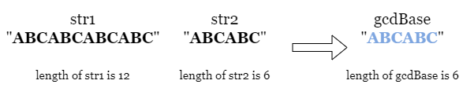
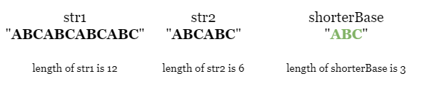
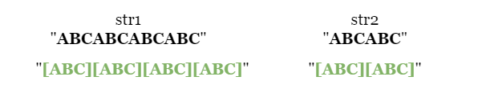
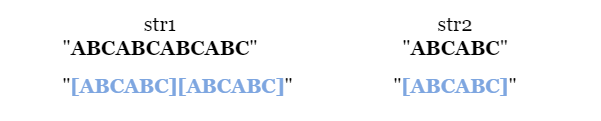

# 1071. Greatest Common Divisor of Strings


## Problem Statement
For two strings `s` and `t`, we say "`t` divides `s`" if and only if `s = t + t + t + ... + t + t` (i.e., `t` is concatenated with itself one or more times).

Given two strings `str1` and `str2`, return the largest string `x` such that `x` divides both `str1` and `str2`.

### Example 1:
*Input:*
```
str1 = "ABCABC"
str2 = "ABC"
```
*Output:*
```
"ABC"
```

### Example 2:
*Input:*
```
str1 = "ABABAB"
str2 = "ABAB"
```
*Output:*
```
"AB"
```
### Example 3:
*Input:*
```
str1 = "LEET"
str2 = "CODE"
```
*Output:*
```
""
```

### Constraints:
- $1 <= str1.length, str2.length <= 1000$
- str1 and str2 consist of English uppercase letters.

## Solution
In this problem, we are looking for the Greatest Common Divisor of two strings, which for convenience we will consider as the GCD string. To remove ambiguity, here we regard:
- all strings that divides both str1 and str2 as divisible strings.
- the longest string among all divisible strings as the GCD string.

### Approach 1: Brute Force
**Intuition:**

We start by introducing a brute force method that checks every possible string until we find the GCD string. Before we do that, let's clarify a few things:

> What are the possible candidate strings?

Here we make use of prefix strings. If a string `base` is the GCD string, it must be a prefix of both str1 and str2. So instead of trying every combination of characters, we just take the shorter string among `str1` and `str2` as initial `base` and check if it is the GCD string.

> What is the order we should check in?

As the problem indicates that we should look for the greatest common divisor string (longest length), we should start with the longest possible prefix string, which is the shorter string between `str1` and `str2` (any longer string is guaranteed not to be a divisible string since it will be longer than at least one string). If the current `base` is not valid, we can check the next shorter prefix by removing the last character from `base`.



> How to verify if `base` is the GCD string?

If `base` is the `GCD` string, then both `str1` and `str2` are made up of multiples of `base`, so we just need to check if `str1` and `str2` can be made up of multiple `base` concatenations. We first check if the length of `str` is divisible by the length of `base`. If so, we multiply `base` by the number of times the lengths divide and check if the made-up string equals `str`.



**Algorithm:**

1. Find the shorter string among str1 and str2, without loss of generality, let it be str1.
1. Start with base = str1, and check if both str1 and str2 are made of multiples of base.
    - If so, return base.
    - Otherwise, we shall try a shorter string by removing the last character from base.
1. If we have checked all prefix strings without finding the GCD string, return "".

**Implementation:**

```java
class Solution {
    public String gcdOfStrings(String str1, String str2) {
        String base = str1.length() < str2.length() ? str1 : str2;

        for (int i = base.length(); i >= 1; i--) {
            if (valid(str1, str2, base)) {
                return base;
            } else {
                base = base.substring(0, i - 1);
            }
        }
        return base;
    }

    public boolean valid(String s1, String s2, String gcd) {
        int g = gcd.length();
        int m = s1.length();
        int n = s2.length();

        if(m % g == 0 && n % g == 0) {
            return s1.replace(gcd, "").isEmpty() && s2.replace(gcd, "").isEmpty();
        }
        return false;
    }
}

```

**Complexity Analysis:**

Let `m`, `n` be the lengths of the two input strings `str1` and `str2`.

- **Time complexity:** $O(min(m,n)⋅(m+n))$

    We checked every prefix string base of the shorter string among `str1` and `str2`, and verify if both strings are made by multiples of `base`. There are up to `min(m,n)` prefix strings to verify and each check involves iterating over the two input strings to check if the current `base` is the GCD string, which costs `O(m+n)`. Therefore, the overall time complexity is `O(min(m,n)⋅(m+n))`.

- **Space complexity:** $O(min(m,n))$

    We need to keep a copy of `base` in each iteration, which takes `O(min(m,n))` space.

### Approach 2: Mathematical approach

**Intution:**

Here is a more mathmatical approach to the problem. Note that this approach is more advanced/elegant and you should not feel discouraged if you do not come up with it on the spot in an interview.

> How to verify if there exists any divisible string?

Suppose there exists a divisible string `base`, we can write `str1` and `str2` in the form of multiples of `base`. Take the following picture as an example.



Since both strings contains multiples of the identical segment `base`, their concatenation must be consistent, regardless of the order `(str1 + str2 = str2 + str1)`.



Therefore, we need to check if two concatenations made by `str1` and `str2` in both orders are the same. If they are not consistent, it means there is no divisible strings and we should return "" as required. Otherwise, there exists a GCD string of `str1` and `str2`.

> If there are divisible strings, what is the length of the GCD string?

We focus on the substring `gcdBase` whose length equals the greatest common divisor of the lengths of `str1` and `str2` (take the above picture as an example, the lengths of `str1` and `str2` are `9` and `6`, so we focus on the substring of length `3`, which is `gcdBase = ABC`). We will show that if there exists divisible strings, then the `gcdBase` must be the GCD string.

For convenience, we refer to the length of `str1`, `str2` and `gcdBase` as `m`, `n`, `gcdLength` respectively.

> Is it possible for the GCD string to be shorter than gcdBase?

No. We can prove it by contradiction. Assume that a string `shorterBase` is shorter than `gcdBase` (`shorterLength < gcdLength`, and `gcdBase` is not the GCD string).
    
- `shorterBase` is a divisible string, thus shorterLength is a divisor of `m` and `n`.
- Since `gcdLength` is the greatest common divisor of `m` and `n`, `gcdLength` is divisible by `shorterLength`.
- Both `str1` and `str2` contains multiples of `gcdBase`, so `gcdBase` is also a divisible string, which means that the GCD string is at least as long as `gcdBase`.
- Therefore it is not possible for the GCD string to be shorter than `gcdBase`.

Let's look at the following example where `gcdBase = ABCABC`. Note that we are not sure if `gcdBase` is the GCD string yet.



There exists a shorter substring `shorterBase = ABC` which divides both `str1` and `str2`. Can this divisible string be the GCD of strings?



Both `str1` and `str2` contain multiples of `shorterBase`.



Recall that the length of `gcdBase` is the GCD of the lengths of `str1` and `str2`, thus it is divisible by the length of `shorterBase`.


Since `gcdLength` is a divisor of both `m` and `n`, both `str1` and `str2` contain multiples of `gcdBase`, thus `gcdBase` is also a divisible string.



We have shown that if there is a shorter string that divides both `str1` and `str2`, then `gcdBase` is also a divisible string, so a divisible string shorter than `gcdBase` can never be the GCD string.

> Is it possible for the a string longer than `gcdBase` to be divisible, and thus `gcdBase` is not the GCD string?

No. Assume that there exists a string `longerBase` that is a divisible string with length `longerLength > gcdLength`,
- Since `longerBase` is a divisible string, its length `longerLength` must be a divisor of `m` and `n`.
- This contradicts the assumption that `gcdLength` is the GCD of `m` and `n`.
- Therefore there doesn't exist a divisible string longer than `gcdBase`.

**In conclusion, if there exists divisible strings, the GCD string must be `gcdBase`.**


**Algorithm:**

1. Check if the concatenations of `str1` and `str2` in different orders are the same.
    - If not, return "".
2. Get the GCD `gcdLength` of the two lengths of `str1` and `str2`.
3. Return the prefix string with a length of `gcdLength` of either `str1` or `str2` as the answer.

**Implementation:**

```java
class Solution {
    public int gcd(int x, int y) {
        if (y == 0) {
            return x;
        } else {
            return gcd(y, x % y);
        }    
    }
    
    public String gcdOfStrings(String str1, String str2) {
        // Check if they have non-zero GCD string.
        if (!(str1 + str2).equals(str2 + str1)) {
            return "";
        }
        
        // Get the GCD of the two lengths.
        int gcdLength = gcd(str1.length(), str2.length());
        return str1.substring(0, gcdLength);
    }
}
```

**Complexity Analysis:**
Let `m`,`n` be the lengths of the two input strings `str1` and `str2`.

- **Time complexity:** $O(m+n)$
    - We need to compare the two concatenations of length `O(m+n)`, it takes `O(m+n)` time.
    - We calculate the GCD using binary `Euclidean` algorithm, it takes `log(m⋅n)` time.
    - To sum up, the overall time complexity is `O(m+n)`.
- **Space complexity:** $O(m+n)$
    - We need to compare the two concatenations of length `O(m+n)`.